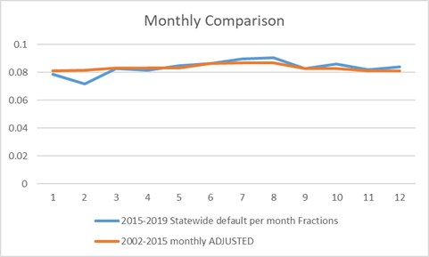
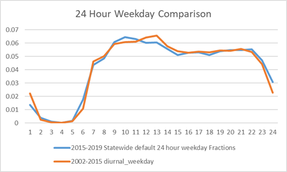
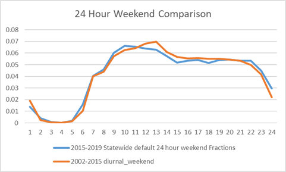
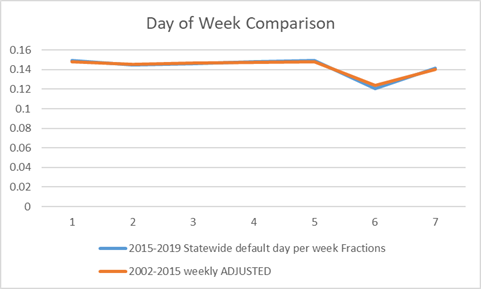
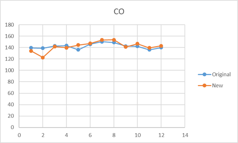
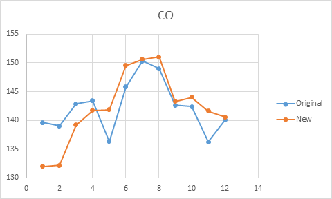

**Airport Temporal Profile Update Documentation**

Updated in 2020 by Marco Lou

## Airport Temporal Fractions:

The purpose of the airport temporal profile is to provide default
fractions to allocate aircraft emissions for California airports. The
profile includes fractions for diurnal weekday and weekend, monthly, and
weekly for default statewide and individual airports. The last airport
temporal profile was created by John Stilley and used data from 2002 to
2015. This documentation is written to describe the process of replacing
the previous data from 2002 to 2015 with new data from 2015 to 2019.

## Collecting New Data:

Data from the Bureau of Transportation Statistics website for Reporting
Carrier On-Time Performance (1987-present) was used for the 2020 update:
<https://www.transtats.bts.gov/DL_SelectFields.asp?Table_ID=236>

Monthly files from 2015 to 2019 were pulled from the following fields:

-   MONTH

-   DAY\_OF\_MONTH

-   DAY\_OF\_WEEK

-   FL\_DATE

-   ORIGIN\_AIRPORT\_ID

-   ORIGIN\_CITY\_NAME

-   DEST\_AIRPORT\_ID

-   DEST\_CITY\_NAME

-   DEP\_TIME

-   TAXI\_OUT\*

-   TAXI\_IN\*

-   ARR\_TIME

-   CANCELLED

\*TAXI\_OUT and TAXI\_IN fields were pulled in case the fields can be
used to update the flight stage fractions; however since landing and
takeoff information are not provided in the BTS dataset, TAXI\_OUT and
TAXI\_IN fields were not used in the update and can be omitted in future
updates.

The old and new data had different airports in their sets. The new BTS
data (2015 to 2019) have data for all airports except for Oxnard and
Camarillo airports that are present in the 2002-2015 dataset. On the
other hand, the recent data has data not found in the 2002-2015 dataset
for a handful of other airports:

• Palm Springs

• Ontario

• Santa Rosa

• Sacramento

• Santa Maria

• Crescent City

• Bakersfield

• Redding

• Monterey

• Stockton

• San Luis Obispo

• Mammoth Lakes

• Arcata/Eureka

• Oakland

• Carlsbad

Since Oxnard and Camarillo airports are not included in the new dataset,
Oxnard and Camarillo airport fractions from the old 2002-2015 dataset
are kept and the new 2015-2019 dataset is used for default statewide and
the remaining airports.

The raw and renamed monthly files pulled from the BTS database for this
update can be found at

W:\\aircraft\_analisis\\Bureau\_of\_Transportation\_Statistics\\BTS\_2015-2019\_MONTHLY

Please note that some of the files in the directory above are bigger
than others. The files bigger in size may include records unrelated to
California and were downloaded prior to using the “Filter Geography”
feature on the BTS website in order to filter out only California
records.

## Development of Temporal Profiles:

An existing Python script used to develop the aircraft temporal files
was also updated to added more functionality. The new Python script:
bureau\_of\_trans.py, allows the option to generate airport specific and
year specific reports as well as calculate average taxi time for each
airport using the TAXI\_IN and TAXI\_OUT fields pulled from the BTS
database. The new script also accounts for flights traveling within
California, whereas the old script was not properly accounting for
flights that had origin and destination within California airports. This
change in methodology did not significantly change the overall
fractions. For more information about the updated Python script, please
refer to the copy of the bureau\_of\_trans.py. A copy of the version of
bureau\_of\_trans.py used to generate the 2020 fractions can be found in
W:\\aircraft\_analisis\\Bureau\_of\_Transportation\_Statistics.

## Old and New Fractions Comparison:

To compare the old and new airport fractions, the following Excel
Spreadsheet was created:

W:\\aircraft\_analisis\\Bureau\_of\_Transportation\_Statistics\\
BTS\_2002-2015\_2015-2019\_comparison.xlsx

The default values for the new dataset was calculated using the average
of all airports included in the 2015-2019 dataset. The default values
from the 2002-2015 dataset were normalized differently than the default
values from the 2015-2019 dataset, i.e. the sum of the monthly 2002-2015
default values is 12, whereas the sum of the monthly 2015-2019 default
values is 1. Hence, the 2002-2015 values were adjusted accordingly for
the comparison. The Spreadsheet includes the data used to create the
plots shown below.

The “Monthly Comparison” plot above compares the default monthly values
of the 2002-2015 dataset and that of the 2015-2019 dataset across the
months of the year. The new data observes a moderate decrease in flights
during February and slightly more flights in the summer months of July
and August. Overall, the amount of flights within each month does not
seem to differ significantly between the new and old datasets.

The “24 Hour Weekday Comparison” plot above compares the default hourly
values of the 2002-2015 dataset and that of the 2015-2019 dataset during
the weekdays. The two datasets match nicely with a slight variance
during hours 10 and 13.

The “24 Hour Weekend Comparison” plot above compares the default hourly
values of the 2002-2015 dataset and that of the 2015-2019 dataset during
the weekends. Similar to the weekday comparison, the two datasets match
nicely with a slight variance during hours 10 and 13.

The “Day of Week Comparison” plot above compares the default daily
values of the 2002-2015 dataset and that of the 2015-2019 dataset
throughout each day of the week. This comparison observes the least
variance of the four comparisons made.

Overall, the fractions match fairly well with a slight variance in hours
10 and 13 in the diurnal profiles and February in the monthly profile.
Considering that the new 2015-2019 dataset is included data that is more
recent, we experimented with using the new 2015-2019 dataset, only
keeping the data for Oxnard and Camarillo airports from the old
2002-2015 dataset. However, after Daniel ran GATE using the airport
temporal files, we observed an alarming drop in CO emissions during the
month of February:

The plot above compares the CO emissions from the 2002-2015 dataset
(Original) and that from the 2015-2019 dataset (New).

The drop in emissions in February is caused by not accounting for the
smaller amount of days in the month of February. Monthly fractions were
calculated by simply dividing the amount of flights in the month by the
total amount of flights in the year. By doing so, we treated each month
equally as if they all had equal amount of days. To fix this issue, we
calculated the amount of flights in the month divided by the total
amount of days in that particular month within the years being
processed, i.e. 141 days in February for years 2015-2019, then dividing
the result by the total amount of flights in the dataset. The new method
of calculating monthly fractions resulted in a smaller emission drop in
February after running GATE:

The plot above compares the CO emissions from the 2002-2015 dataset
(Original) and that from the 2015-2019 dataset (New) after the new
method of calculating monthly fractions. The new dataset is more
preferable since it has less dramatic drops throughout the months,
notably in May and November.

## Generating 2020 Airport Input Fractions:

Due to the 2020 pandemic, the airline industry has experienced a massive
decrease in traffic. We decided to utilize the number of flights
recorded in the BTS dataset for 2019 and 2020 to analyze the decrease in
flights in 2020.

During this process, the Python script used to generate the 2015-2019
fractions above is modified to allow for day to day comparisons. The
previous script’s data structure split the tallies from airport to year
to month to day of week to hour of day. The newly modified script stores
the tallies from airport to year to Julien day to hour of day.

Since January 1st is on a Tuesday in 2019 and on a Wednesday
in 2020, a one day shift was used in calculating the percentage
difference between flights in 2020 and that in 2019 such that the
flights on Wednesday, January 1, 2020 is divided by flights on
Wednesday, January 2, 2019. 2020 is also a leap year so a two day shift
similar to the one day shift was used after March 1, 2020. By applying
this shift, we can analyze the differences in flights observed each day
in 2020.

Daily comparisons were used to generate monthly comparisons for
statewide and individual airports. Below is the calculated monthly
statewide differences:

|           | January  | February | March   | April    | May      | June    |
|-----------|----------|----------|---------|----------|----------|---------|
| statewide | 1.038142 | 1.056766 | 0.85885 | 0.269409 | 0.243666 | 0.32311 |

The calculated monthly percentage differences suggests that the decrease
in airport traffic started in March 2020 with a 15% decrease from 2019
with a 75% decrease in April and May and a 68% decrease in June from
2019. For smaller airports such as SMX with about 30 flights per month
in 2019 with flights not occurring daily, the monthly totals from 2020
and 2019 were used to calculate the monthly percentage differences
instead of daily flight totals.

The differences between flights in 2020 and that in 2019 calculated with
this method are different from the Geotab data from Corey’s group in
which the Geotab data suggests a smaller decrease of around 40-50%.
After discussing the difference with Elizabeth in Corey’s group, we
concluded to continue with BTS data used in this method since Geotab
lacked data from 2019 and uses March 16, 2020 as the baseline.

The monthly percentage difference were multiplied by the monthly
fractions of 2019 to create the adjusted monthly fractions of 2020. This
calculation was done manually on the Excel Spreadsheet:

W:\\aircraft\_analisis\\Bureau\_of\_Transportation\_Statistics\\normalizing\_Fractions.xlsx

The adjusted monthly fractions for 2020 statewide and individual
airports were combined with the diurnal weekday, diurnal weekend, and
weekly fractions generated from the Python script, bureau\_of\_trans.py,
using exclusively the 2020 data from BTS. The sets of four fractions for
statewide and each individual airport were formatted to create an input
file for GATE:

W:\\aircraft\_analisis\\Bureau\_of\_Transportation\_Statistics\\bts\_flighttally\_statewide\_fyear\_2020.csv

A copy of this input file can be found in Appendix I.

## Appendix I:

airport,eic,type,fractions\|

default,default,diurnal\_weekday,0.00871231872824\|0.0022492495455\|0.000383330749609\|6.76466028722e-05\|0.00133883901518\|0.0150006341869\|0.0426962808461\|0.0492692757586\|0.0626661217357\|0.0648110827684\|0.0660315402286\|0.0658426934622\|0.0638555745029\|0.0589878377045\|0.0497991741477\|0.05032343532\|0.0551404371662\|0.0522259960258\|0.0587313443353\|0.0571726538608\|0.057820933805\|0.0530264808264\|0.0390349084657\|0.0248122102118

default,default,diurnal\_weekend,0.00996392507758\|0.00248901211424\|0.000433214133808\|8.66428267616e-05\|0.00167772019093\|0.0146426377227\|0.0402574079617\|0.0472124639645\|0.0626427637486\|0.0663290221963\|0.0676522944596\|0.0682272877645\|0.065005749933\|0.0600907386695\|0.0490713464295\|0.0509302288946\|0.0569007073205\|0.0524425400526\|0.0580270640684\|0.0550181949936\|0.0567195450464\|0.0513398131666\|0.0381937333606\|0.0246459459034

default,default,monthly,0.9745\|0.980215\|0.836187\|0.267162\|0.240371\|0.335692\|0\|0\|0\|0\|0\|0

default,default,weekly,1.04344017453\|0.977892776854\|1.02160072902\|1.05762201008\|1.05467230453\|0.854411999759\|0.990360005231

SMX,default,diurnal\_weekday,0.0\|0.0\|0.0\|0.0\|0.0\|0.0\|0.0\|0.0147058823529\|0.117647058824\|0.279411764706\|0.0294117647059\|0.0441176470588\|0.117647058824\|0.102941176471\|0.0441176470588\|0.0588235294118\|0.0882352941176\|0.0441176470588\|0.0294117647059\|0.0\|0.0\|0.0294117647059\|0.0\|0.0

SMX,default,diurnal\_weekend,0.0\|0.0\|0.0\|0.0\|0.0\|0.0\|0.0\|0.0\|0.105263157895\|0.157894736842\|0.0789473684211\|0.0263157894737\|0.0789473684211\|0.0526315789474\|0.0263157894737\|0.0263157894737\|0.0526315789474\|0.263157894737\|0.131578947368\|0.0\|0.0\|0.0\|0.0\|0.0

SMX,default,monthly,0.9411764706\|1\|0.5714285714\|0\|0.427119\|0.504407\|0\|0\|0\|0\|0\|0

SMX,default,weekly,0.792452830189\|0.0\|1.32075471698\|0.0\|2.37735849057\|0.0\|2.50943396226

OAK,default,diurnal\_weekday,0.010013437947\|0.00130044648663\|0.000216741081105\|8.66964324418e-05\|0.0\|0.0282196887598\|0.0397503142746\|0.0460358056266\|0.0648922796827\|0.0631150028176\|0.0587368329793\|0.0454722788157\|0.0532316095193\|0.0552256274654\|0.0457323681131\|0.0468160735186\|0.0543153149248\|0.0498071004378\|0.0824916554684\|0.0732151371971\|0.0625081277905\|0.0597771901686\|0.0355455373011\|0.0234947331917

OAK,default,diurnal\_weekend,0.0111378306543\|0.00151879508923\|0.0\|0.0\|0.000126566257436\|0.0191115048728\|0.038349576003\|0.0435387925579\|0.0693583090748\|0.0636628274902\|0.0606252373117\|0.0534109606379\|0.0558157195292\|0.0544234906974\|0.0534109606379\|0.0520187318061\|0.0548031894697\|0.0567016833312\|0.0774585495507\|0.0740412605999\|0.0478420453107\|0.0568282495887\|0.0317681306164\|0.0240475889128

OAK,default,monthly,0.924295\|0.919041\|0.785692\|0.294634\|0.272819\|0.417683\|0\|0\|0\|0\|0\|0

OAK,default,weekly,1.05824991928\|0.992250565063\|1.01937358734\|1.07384565709\|1.0704552793\|0.802841459477\|0.982983532451

ACV,default,diurnal\_weekday,0.0152008686211\|0.00108577633008\|0.00108577633008\|0.00108577633008\|0.0\|0.0466883821933\|0.120521172638\|0.00760043431053\|0.042345276873\|0.0173724212812\|0.0868621064061\|0.117263843648\|0.0738327904452\|0.0532030401737\|0.0336590662324\|0.0401737242128\|0.00977198697068\|0.0510314875136\|0.0890336590662\|0.0184581976113\|0.0162866449511\|0.0369163952226\|0.0499457111835\|0.0705754614549

ACV,default,diurnal\_weekend,0.00797872340426\|0.00531914893617\|0.0\|0.0\|0.0\|0.0505319148936\|0.130319148936\|0.00265957446809\|0.0425531914894\|0.00531914893617\|0.0877659574468\|0.109042553191\|0.0877659574468\|0.0345744680851\|0.0345744680851\|0.0558510638298\|0.00531914893617\|0.061170212766\|0.093085106383\|0.0186170212766\|0.00797872340426\|0.0425531914894\|0.0425531914894\|0.0744680851064

ACV,default,monthly,1.276321\|1.1848\|1.003741\|0.172913\|0.360414\|0.33159\|0\|0\|0\|0\|0\|0

ACV,default,weekly,0.944487278335\|1.02544333076\|0.982266769468\|0.998457979954\|1.0200462606\|1.00385505012\|1.02544333076

SMF,default,diurnal\_weekday,0.00634215950531\|0.000554938956715\|0.000118915490725\|3.96384969082e-05\|7.92769938164e-05\|0.0217218963057\|0.04705089583\|0.0409069288093\|0.0502219755827\|0.0588631679087\|0.0671872522594\|0.0747582051689\|0.0641350879975\|0.0607261772634\|0.057872205486\|0.0541065482797\|0.051807515459\|0.056564135088\|0.0639765340098\|0.0585856984303\|0.0566830505787\|0.040153797368\|0.0392024734422\|0.0283415252894

SMF,default,diurnal\_weekend,0.0103399096744\|0.000594247682434\|0.000475398145947\|0.0\|0.000118849536487\|0.0221060137865\|0.0445685761826\|0.0383884002852\|0.058830520561\|0.0600190159258\|0.0613263608272\|0.0730924649394\|0.0733301640124\|0.0615640599002\|0.0525314951272\|0.0525314951272\|0.0502733539339\|0.0509864511528\|0.0696458283813\|0.0502733539339\|0.0578797242691\|0.0467078678393\|0.0375564535298\|0.026859995246

SMF,default,monthly,1.002001\|1.001534\|0.859949\|0.356664\|0.3257\|0.456082\|0\|0\|0\|0\|0\|0

SMF,default,weekly,1.06117353308\|1.01456512692\|1.03703703704\|1.07948397836\|1.05701206825\|0.78506034124\|0.965667915106

SAN,default,diurnal\_weekday,0.000343423441103\|0.0\|0.0\|0.0\|0.0\|7.35907373792e-05\|0.0579895010548\|0.0595839670313\|0.0575234263847\|0.0584065152333\|0.06449001619\|0.0625030662807\|0.072192513369\|0.0667467988029\|0.052273953785\|0.0473924348722\|0.0436147770201\|0.0462149830741\|0.0614973262032\|0.068758278958\|0.0610312515331\|0.0528136191925\|0.043026051121\|0.0235245057155

SAN,default,diurnal\_weekend,0.00137127185465\|0.000411381556394\|0.000274254370929\|6.85635927323e-05\|0.0\|0.000205690778197\|0.06198148783\|0.0543023654439\|0.0520397668838\|0.0610215975317\|0.0638327048337\|0.0663695577648\|0.0729516626671\|0.0641069592047\|0.0499142955091\|0.0514912581419\|0.0488858416181\|0.0514912581419\|0.0597188892698\|0.0638327048337\|0.0567020911896\|0.0514226945492\|0.0438121357559\|0.0237915666781

SAN,default,monthly,0.948209\|0.953456\|0.831104\|0.301085\|0.245403\|0.351093\|0\|0\|0\|0\|0\|0

SAN,default,weekly,1.05143538509\|0.980614623042\|1.01450741631\|1.05409116366\|1.05484995754\|0.845675778215\|0.99882567614

SCK,default,diurnal\_weekday,0.0\|0.0\|0.0\|0.0\|0.0\|0.0939716312057\|0.0124113475177\|0.0390070921986\|0.0425531914894\|0.00709219858156\|0.00709219858156\|0.0124113475177\|0.040780141844\|0.0957446808511\|0.101063829787\|0.0992907801418\|0.0939716312057\|0.0602836879433\|0.0212765957447\|0.0354609929078\|0.0975177304965\|0.0957446808511\|0.0336879432624\|0.0106382978723

SCK,default,diurnal\_weekend,0.0106382978723\|0.00531914893617\|0.0\|0.0\|0.0\|0.0851063829787\|0.031914893617\|0.0265957446809\|0.0531914893617\|0.031914893617\|0.0106382978723\|0.00531914893617\|0.00531914893617\|0.0372340425532\|0.117021276596\|0.132978723404\|0.122340425532\|0.101063829787\|0.0159574468085\|0.0265957446809\|0.106382978723\|0.0478723404255\|0.0212765957447\|0.00531914893617

SCK,default,monthly,1.404421\|1.55585\|0.802869\|0.086811\|0.425861\|0.528295\|0\|0\|0\|0\|0\|0

SCK,default,weekly,1.23803191489\|0.679521276596\|0.865691489362\|1.17287234043\|1.29388297872\|0.577127659574\|1.17287234043

BUR,default,diurnal\_weekday,0.000337586928634\|0.000270069542907\|0.0\|0.0\|0.0\|0.0\|0.0159341030315\|0.0754844372426\|0.0525960434812\|0.0550266693674\|0.0694753899129\|0.0676524204983\|0.0738640199851\|0.0704881506988\|0.0584700560394\|0.0592802646682\|0.0665046249409\|0.057592330025\|0.0596178515968\|0.0720410505705\|0.0698129768415\|0.0665721423266\|0.00776449935858\|0.00121531294308

BUR,default,diurnal\_weekend,0.000212359311956\|0.0\|0.0\|0.0\|0.0\|0.0\|0.014652792525\|0.0658313867063\|0.0592482480357\|0.0641325122107\|0.0762369929921\|0.0666808239541\|0.0734763219367\|0.0838819282226\|0.0539392652368\|0.0566999362922\|0.0651943087704\|0.0560628583563\|0.0630707156509\|0.0677426205139\|0.0662561053302\|0.0547887024846\|0.00976852834997\|0.00212359311956

BUR,default,monthly,1.043685\|1.053783\|0.82179\|0.305253\|0.265556\|0.372519\|0\|0\|0\|0\|0\|0

BUR,default,weekly,1.07330942623\|1.01629098361\|1.06900614754\|1.0887295082\|1.06398565574\|0.730840163934\|0.957838114754

FAT,default,diurnal\_weekday,0.0034665207079\|0.00145958766648\|0.0\|0.0\|0.0\|0.0277321656632\|0.103813172779\|0.0242656449553\|0.0200693304142\|0.055829228243\|0.0594781974092\|0.0804597701149\|0.0777230432403\|0.0554643313264\|0.0279146141215\|0.0782703886152\|0.0565590220763\|0.0525451559934\|0.0678708264915\|0.0405035577449\|0.0638569604087\|0.0483488414523\|0.0297390987046\|0.0246305418719

FAT,default,diurnal\_weekend,0.00294695481336\|0.00147347740668\|0.0\|0.0\|0.0\|0.0275049115914\|0.112475442043\|0.0240667976424\|0.0230844793713\|0.0599214145383\|0.0550098231827\|0.0741650294695\|0.0820235756385\|0.0604125736739\|0.0309430255403\|0.0682711198428\|0.0530451866405\|0.0476424361493\|0.0638506876228\|0.041257367387\|0.065815324165\|0.0515717092338\|0.028978388998\|0.0255402750491

FAT,default,monthly,0.948294\|0.95058\|0.82133\|0.308424\|0.308012\|0.370595\|0\|0\|0\|0\|0\|0

FAT,default,weekly,1.04762538247\|0.949847013436\|1.00106425436\|1.04576293734\|1.05973127577\|0.901423440202\|0.994545696421

ONT,default,diurnal\_weekday,0.0110161276108\|0.00123380629241\|0.0\|8.81290208866e-05\|0.00220322552216\|0.0319908345818\|0.057460121618\|0.0383361240857\|0.0418612849211\|0.0617784436415\|0.0863664404688\|0.0705032167093\|0.0587820569313\|0.0457389618401\|0.04970476778\|0.0438882524015\|0.0539349607826\|0.0516436062395\|0.0616903146206\|0.050497928968\|0.0508504450516\|0.0475896712788\|0.0400105754825\|0.0428307041509

ONT,default,diurnal\_weekend,0.0135862599334\|0.00153806716227\|0.0\|0.0\|0.00333247885158\|0.0266598308126\|0.0528069725711\|0.0374263009485\|0.0440912586516\|0.0661368879774\|0.0886952063573\|0.0725455011536\|0.05203793899\|0.046142014868\|0.0474237375032\|0.0466547039221\|0.0563957959498\|0.0561394514227\|0.0589592412202\|0.0563957959498\|0.063573442707\|0.0435785695975\|0.0269161753397\|0.0389643681107

ONT,default,monthly,1.04157\|1.034303\|0.872966\|0.344706\|0.32316\|0.512826\|0\|0\|0\|0\|0\|0

ONT,default,weekly,1.07286201469\|0.982423924449\|1.02970881427\|1.07378016789\|1.05036726128\|0.785939139559\|1.00491867786

MRY,default,diurnal\_weekday,0.00422386483633\|0.000527983104541\|0.0\|0.0\|0.0\|0.0549102428722\|0.0580781414995\|0.0153115100317\|0.00316789862724\|0.0100316789863\|0.0950369588173\|0.146779303062\|0.111932418163\|0.071277719113\|0.0385427666315\|0.0876451953537\|0.0496304118268\|0.0353748680042\|0.0411826821542\|0.044878563886\|0.0401267159451\|0.0343189017951\|0.0237592397043\|0.0332629355861

MRY,default,diurnal\_weekend,0.00140056022409\|0.0\|0.0\|0.0\|0.0\|0.0532212885154\|0.0616246498599\|0.0182072829132\|0.00140056022409\|0.00980392156863\|0.0896358543417\|0.147058823529\|0.109243697479\|0.0686274509804\|0.0448179271709\|0.0952380952381\|0.047619047619\|0.0196078431373\|0.046218487395\|0.0448179271709\|0.0420168067227\|0.0266106442577\|0.0350140056022\|0.0378151260504

MRY,default,monthly,0.954984\|1.045571\|0.883028\|0.342982\|0.263658\|0.303112\|0\|0\|0\|0\|0\|0

MRY,default,weekly,1.10851226994\|0.86963190184\|0.998466257669\|0.98773006135\|1.11924846626\|0.909892638037\|1.00651840491

BFL,default,diurnal\_weekday,0.00573888091822\|0.000717360114778\|0.0\|0.000717360114778\|0.0\|0.149928263989\|0.0817790530846\|0.0114777618364\|0.0100430416069\|0.00430416068867\|0.0545193687231\|0.128407460545\|0.0939741750359\|0.0466284074605\|0.012912482066\|0.0868005738881\|0.0695839311334\|0.00789096126255\|0.019368723099\|0.00932568149211\|0.101865136298\|0.0659971305595\|0.0143472022956\|0.0236728837877

BFL,default,diurnal\_weekend,0.00184842883549\|0.00184842883549\|0.0\|0.0\|0.0\|0.147874306839\|0.0850277264325\|0.0129390018484\|0.00924214417745\|0.00554528650647\|0.0536044362292\|0.134935304991\|0.083179297597\|0.0628465804067\|0.00739371534196\|0.0757855822551\|0.0609981515712\|0.0110905730129\|0.0166358595194\|0.0129390018484\|0.1146025878\|0.0554528650647\|0.0184842883549\|0.0277264325323

BFL,default,monthly,1.175559\|1.197051\|1.058632\|0.459658\|0.454387\|0.479204\|0\|0\|0\|0\|0\|0

BFL,default,weekly,1.05633074935\|0.95142118863\|1.0165374677\|1.0165374677\|1.00206718346\|0.95142118863\|1.00568475452

RDD,default,diurnal\_weekday,0.0127388535032\|0.0015923566879\|0.0\|0.0\|0.0\|0.0700636942675\|0.156050955414\|0.00955414012739\|0.0875796178344\|0.0700636942675\|0.0875796178344\|0.0143312101911\|0.0031847133758\|0.0015923566879\|0.0031847133758\|0.0\|0.0143312101911\|0.125796178344\|0.114649681529\|0.00796178343949\|0.0015923566879\|0.0748407643312\|0.0493630573248\|0.093949044586

RDD,default,diurnal\_weekend,0.0164609053498\|0.00411522633745\|0.0\|0.0\|0.0\|0.0781893004115\|0.148148148148\|0.0\|0.0864197530864\|0.0864197530864\|0.0740740740741\|0.0082304526749\|0.0\|0.00411522633745\|0.00411522633745\|0.0\|0.0205761316872\|0.0987654320988\|0.139917695473\|0.0082304526749\|0.0082304526749\|0.0452674897119\|0.0699588477366\|0.0987654320988

RDD,default,monthly,1.198418\|1.281546\|0.970148\|0.240187\|0.278438\|0.26416\|0\|0\|0\|0\|0\|0

RDD,default,weekly,1.0045924225\|1.01262916188\|1.02066590126\|1.01262916188\|0.996555683123\|0.940298507463\|1.01262916188

STS,default,diurnal\_weekday,0.000622665006227\|0.000622665006227\|0.0\|0.0\|0.0\|0.0118306351183\|0.0803237858032\|0.0323785803238\|0.0093399750934\|0.0398505603985\|0.109589041096\|0.0834371108344\|0.150062266501\|0.0628891656289\|0.0118306351183\|0.0130759651308\|0.0348692403487\|0.0952677459527\|0.0890410958904\|0.046699875467\|0.0473225404732\|0.0093399750934\|0.060398505604\|0.0112079701121

STS,default,diurnal\_weekend,0.00501672240803\|0.0\|0.0\|0.0\|0.0\|0.0100334448161\|0.0886287625418\|0.0334448160535\|0.0150501672241\|0.0401337792642\|0.107023411371\|0.0919732441472\|0.140468227425\|0.0702341137124\|0.0133779264214\|0.00167224080268\|0.0401337792642\|0.0903010033445\|0.0903010033445\|0.0451505016722\|0.0334448160535\|0.00836120401338\|0.0585284280936\|0.0167224080268

STS,default,monthly,1.326929\|1.370908\|1.267787\|0.414393\|0.294943\|0.484496\|0\|0\|0\|0\|0\|0

STS,default,weekly,1.04809437387\|0.965517241379\|1.02586206897\|1.01950998185\|1.04174228675\|0.895644283122\|1.00362976407

SJC,default,diurnal\_weekday,0.00119578215023\|0.000326122404609\|0.0\|3.62358227344e-05\|0.0\|0.00329745986883\|0.0507663876508\|0.0530492444831\|0.0648258868718\|0.0665289705403\|0.0585933253615\|0.0710584483821\|0.0704424393956\|0.0478312860093\|0.0459107874044\|0.0543537341015\|0.057977316375\|0.0613110120665\|0.0615284270029\|0.0616371344711\|0.0594629851071\|0.0591730985252\|0.0437366380404\|0.006957277965

SJC,default,diurnal\_weekend,0.00171213331811\|0.000342426663623\|0.0\|0.0\|0.0\|0.00388083552106\|0.0489670128981\|0.0519347106495\|0.0572993950462\|0.059924666134\|0.0603812350188\|0.0708823193699\|0.0783015637484\|0.0561579728342\|0.0442871818286\|0.0595822394704\|0.0615226572309\|0.0559296883917\|0.05387512841\|0.0612943727885\|0.0673439105125\|0.0549024084009\|0.045086177377\|0.00639196438763

SJC,default,monthly,0.955602\|0.948137\|0.80085\|0.270114\|0.246471\|0.356703\|0\|0\|0\|0\|0\|0

SJC,default,weekly,1.07989988448\|1.00924143242\|1.04582210243\|1.09318444359\|1.08509819022\|0.739314593762\|0.9474393531

SBP,default,diurnal\_weekday,0.00135043889264\|0.00033760972316\|0.0\|0.0\|0.0\|0.057056043214\|0.0965563808238\|0.0108035111411\|0.0398379473329\|0.0185685347738\|0.0482781904119\|0.0904794058069\|0.105671843349\|0.106684672519\|0.035786630655\|0.0594193112762\|0.0361242403781\|0.025320729237\|0.0705604321404\|0.0320729237002\|0.0708980418636\|0.061107359892\|0.0205941931128\|0.0124915597569

SBP,default,diurnal\_weekend,0.00437828371278\|0.0\|0.0\|0.0\|0.0\|0.0595446584939\|0.0945709281961\|0.0105078809107\|0.0394045534151\|0.0210157618214\|0.0464098073555\|0.0796847635727\|0.106830122592\|0.11646234676\|0.0429071803853\|0.0525394045534\|0.0394045534151\|0.0262697022767\|0.0639229422067\|0.0332749562172\|0.0709281961471\|0.0621716287215\|0.0166374781086\|0.0131348511384

SBP,default,monthly,1.200392\|1.210459\|1.063241\|0.501553\|0.451379\|0.393043\|0\|0\|0\|0\|0\|0

SBP,default,weekly,0.999512670565\|0.953460038986\|1.03703703704\|1.03021442495\|1.03192007797\|0.939814814815\|1.00804093567

SNA,default,diurnal\_weekday,0.0\|0.0\|0.0\|0.0\|0.0\|0.0\|0.0521754203501\|0.0565089270237\|0.0629802969897\|0.0600912925406\|0.074362974519\|0.0688160859768\|0.0671404633963\|0.0671982434853\|0.062055815566\|0.0564511469348\|0.0567978274687\|0.0497486566129\|0.0608424336973\|0.0679493846421\|0.0559311261339\|0.0579534292483\|0.0225920147917\|0.000404460622869

SNA,default,diurnal\_weekend,0.0\|0.0\|0.0\|0.0\|0.0\|0.0\|0.0283948555203\|0.0542842826123\|0.0654751962586\|0.064807082011\|0.0813429096375\|0.0689827960581\|0.0703190245532\|0.0649741105729\|0.0643059963254\|0.063470853516\|0.0559545682312\|0.0536161683648\|0.0594621680307\|0.0631367963922\|0.0597962251545\|0.0594621680307\|0.0217137130449\|0.000501085685652

SNA,default,monthly,0.958393\|0.958826\|0.779332\|0.233072\|0.226988\|0.357719\|0\|0\|0\|0\|0\|0

SNA,default,weekly,1.06830085\|0.991070661973\|1.02713145016\|1.05898514639\|1.05537906757\|0.795140379497\|1.00399244441

LGB,default,diurnal\_weekday,0.000436744795458\|0.000145581598486\|0.0\|0.0\|0.0\|0.0\|0.0540107730383\|0.0481875090988\|0.0433833163488\|0.0564856602125\|0.0812345319552\|0.0947736206144\|0.0650749745232\|0.0557577522201\|0.0496433250837\|0.0628912505459\|0.067404280099\|0.0706070752657\|0.0640559033338\|0.0528461202504\|0.0908429174552\|0.0384335420003\|0.00291163196972\|0.000873489590916

LGB,default,diurnal\_weekend,0.00106685633001\|0.00106685633001\|0.0\|0.0\|0.0\|0.0\|0.0455192034139\|0.0394736842105\|0.0423186344239\|0.0593883357041\|0.0924608819346\|0.102773826458\|0.0697012802276\|0.0568990042674\|0.0401849217639\|0.0593883357041\|0.0910384068279\|0.0679231863442\|0.0593883357041\|0.0494310099573\|0.075746799431\|0.0433854907539\|0.00213371266003\|0.000711237553343

LGB,default,monthly,1.049579\|1.077308\|0.874031\|0.204953\|0.206502\|0.298033\|0\|0\|0\|0\|0\|0

LGB,default,weekly,0.979031091829\|0.948662328272\|0.987707881417\|1.03181489516\|1.01952277657\|0.969631236443\|1.06362979031

SFO,default,diurnal\_weekday,0.0141364562703\|0.0035305261345\|0.00038749677086\|5.74069290163e-05\|0.00180831826401\|0.0130887798157\|0.0292057751371\|0.0468440540773\|0.0726771721347\|0.0789058239329\|0.0709549642642\|0.0666924997847\|0.0596027440512\|0.051910215563\|0.0486236688768\|0.0467292402193\|0.061626338299\|0.0549240793364\|0.0486380206091\|0.0440167628233\|0.0572490599615\|0.0518815120985\|0.0459398949453\|0.0305691897012

SFO,default,diurnal\_weekend,0.0156353055286\|0.00399612027158\|0.000504364694471\|7.75945683802e-05\|0.00205625606208\|0.0130746847721\|0.0288651794374\|0.0474490785645\|0.0716585838991\|0.082250242483\|0.071231813773\|0.0677788554801\|0.0592822502425\|0.0510572259942\|0.047953443259\|0.0459359844811\|0.0654122211445\|0.0531910766246\|0.0484578079534\|0.0439961202716\|0.0551309408341\|0.0487293889428\|0.0463627546072\|0.0299127061106

SFO,default,monthly,0.959885\|0.971107\|0.811577\|0.208752\|0.215791\|0.285897\|0\|0\|0\|0\|0\|0

SFO,default,weekly,1.0335767341\|0.968015672635\|1.02096319655\|1.0406901826\|1.04655694426\|0.90245461117\|0.987742658691

SBA,default,diurnal\_weekday,0.00306150848873\|0.0\|0.0\|0.0\|0.0\|0.0656832730309\|0.0481491789591\|0.0219871973281\|0.012802671862\|0.0370164208183\|0.0592819370999\|0.0965766768717\|0.129418313387\|0.102421374896\|0.0225438352352\|0.0478708600056\|0.0857222376844\|0.0720846089619\|0.0439743946563\|0.0242137489563\|0.0367381018647\|0.0503757305873\|0.00723629279154\|0.0328416365154

SBA,default,diurnal\_weekend,0.00356887937188\|0.000713775874375\|0.0\|0.0\|0.0\|0.0656673804425\|0.0492505353319\|0.02284082798\|0.0128479657388\|0.0406852248394\|0.0563882940757\|0.0906495360457\|0.135617416131\|0.103497501784\|0.028551034975\|0.0442541042113\|0.0692362598144\|0.0749464668094\|0.0585296216988\|0.0242683797288\|0.0335474660956\|0.0435403283369\|0.00785153461813\|0.0335474660956

SBA,default,monthly,1.138278\|1.160879\|1.017001\|0.259566\|0.291032\|0.328781\|0\|0\|0\|0\|0\|0

SBA,default,weekly,1.02603123748\|0.939126952343\|1.01341609932\|1.02883460152\|1.02883460152\|0.934921906288\|1.02883460152

LAX,default,diurnal\_weekday,0.0156446643232\|0.00499066961767\|0.00108492817775\|0.000141040663108\|0.00349346873237\|0.0167187432192\|0.0326671874322\|0.0522609903224\|0.076715271449\|0.0696632382936\|0.0620795903311\|0.0568285379508\|0.0516317319793\|0.057012975741\|0.0490387536345\|0.0469990886603\|0.0523694831402\|0.0477693876665\|0.0557544590548\|0.0578375211561\|0.0538992318709\|0.0547671744131\|0.0465651173892\|0.0340667447815

LAX,default,diurnal\_weekend,0.0163501335603\|0.00490210467608\|0.000968679367129\|0.000234831361728\|0.00425631843133\|0.0169372119647\|0.0281797634074\|0.0515161299792\|0.0764082543224\|0.0692165438694\|0.0657234273637\|0.0608800305281\|0.0501952035694\|0.0586491325917\|0.0486687997182\|0.0467020870637\|0.0521032083835\|0.0486100918778\|0.0567411277776\|0.0563301728946\|0.0543634602401\|0.0541286288784\|0.044970205771\|0.0329644524026

LAX,default,monthly,0.960234\|0.962648\|0.843274\|0.255133\|0.204996\|0.284504\|0\|0\|0\|0\|0\|0

LAX,default,weekly,1.02638645743\|0.967276356752\|1.01385467249\|1.05344624086\|1.05000831756\|0.894636364356\|0.994391590554

PSP,default,diurnal\_weekday,0.00307125307125\|0.000921375921376\|0.0\|0.0\|0.0\|0.0282555282555\|0.0727886977887\|0.0265663390663\|0.0188882063882\|0.0437653562654\|0.0454545454545\|0.0887592137592\|0.109336609337\|0.100583538084\|0.0697174447174\|0.0582002457002\|0.0549754299754\|0.0517506142506\|0.0539004914005\|0.0638820638821\|0.0454545454545\|0.0373157248157\|0.0150491400491\|0.0113636363636

PSP,default,diurnal\_weekend,0.00297729810197\|0.000744324525493\|0.000372162262747\|0.0\|0.0\|0.0271678451805\|0.0681056940826\|0.026423520655\|0.0227018980275\|0.0476367696316\|0.0509862299963\|0.0971343505769\|0.114253814663\|0.0945292147376\|0.0684778563454\|0.054335690361\|0.054335690361\|0.0487532564198\|0.0502419054708\|0.0606624488277\|0.0431708224786\|0.0416821734276\|0.0141421659844\|0.0111648678824

PSP,default,monthly,1.152907\|1.294324\|1.203413\|0.332898\|0.28625\|0.363749\|0\|0\|0\|0\|0\|0

PSP,default,weekly,0.974779867377\|0.928361778454\|0.966409392325\|1.05620176106\|1.02956843135\|0.983911294706\|1.06076747473
