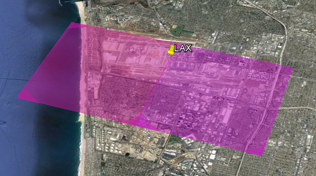

# GATE Basic Introduction - UNDER CONSTRUCTION

    Gridded Aircraft Trajectory Emissions model

The purpose of this document is give a clear understanding of what GATE is, and what it does. This is not meant as a guide to how to run GATE; you will find that in the [User Guide](USER_GUIDE.md).

## Introduction

The GATE (Gridded Aircraft Trajectory Emissions) model distributes aircraft emissions in three dimensions.  Annual emissions inventories are typically designed to report point and area sources and are not well designed for modeling aircraft take-off and landing emissions, as these are fundamentally three dimensional. The GATE model solves this problem.

## How It Works

GATE is written in Python, using only free, open-source technology. It is a command-line program, executable on Linux, PC, or Mac.  The basic modeling steps are:

1. Read in aircraft emissions from an annual inventory
2. Split the emissions into hourly components
3. Split any county-wide emissions into individual runways
4. Geometrically model the 3D take-off, taxing, and landing paths at each runway
5. Intersect the above 3D paths with the 3D modeling grid
6. Distribute the hourly aircraft emissions into the 3D grid

The above six-step process is achievable because so much information is publically reported on: the locations of airport runways, the dates and times of airplane flights, and the angles of take-off and landing.

## Example - LAX

To better understand the purpose of the model, it may be instructive to look at a specific example.  In this case, the example will be the PM emissions from the Los Angeles International Airport (LAX) for an arbitrary day in 2012.  The LAX emissions are distributed across a 4km-by-4km modeling grid.  First, a look at the typical 3D modeling of aircraft emissions from LAX in previous CalEPA and US EPA modeling:

*Figure 1: 3D allocation of LAX PM Emissions, pre-GATE*

Notice that the emissions are centered on the airport, but mostly kept to the ground level, as there was no generally excepted method to allocate airplane emissions in three dimensions.  Contrast this with the standard output from the GATE model:

*Figure 2: 3D allocation of LAX PM Emissions, with GATE*

In this case, the take-off and landing emissions are distributed along the typical flight paths from-and-to each airport runway.  The benefit to the GATE approach is increased realism in downstream modeling.  As the model is very fast to run, the increased realism is practically easy to achieve.

[Back to Main Readme](../README.md)
