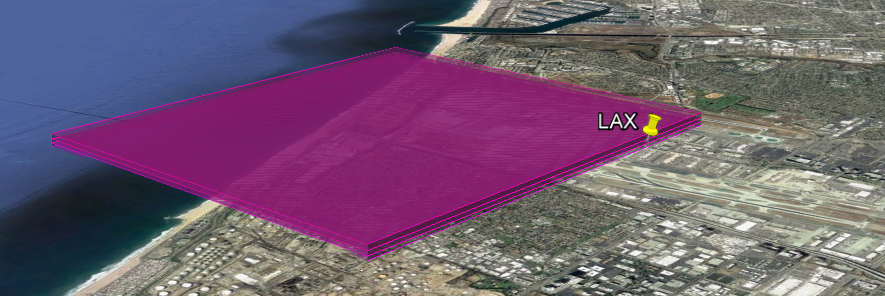

# GATE Basic Introduction

    Gridded Aircraft Trajectory Emissions model

This document provides an explanation of what GATE is and what it does. This is not meant as a guide to using GATE; you will find that in the [User Guide](USER_GUIDE.md).

## Introduction

The GATE (Gridded Aircraft Trajectory Emissions) model distributes aircraft emissions in three dimensions. Annual emissions inventories typically report point and area sources and thus are not well designed for fundamentally three-dimensional data. The GATE model solves this problem.

## How It Works

The GATE model takes annual, ungridded aircraft emissions during: landing, taxiing, and take-off. GATE converts this data into gridded, hourly files with the following steps:

1. Read aircraft emissions from an annual inventory
2. Split the emissions into hourly components
3. Split any county-wide emissions into individual runways
4. 4. Geometrically model the 3D flight paths at each runway
5. Intersect the above 3D paths with the 3D modeling grid
6. Distribute the hourly aircraft emissions into the 3D grid

The above six steps are achievable because of the wealth of public information on: airport runway locations, take-off and landing angles, and the dates and times of commerical flights.

## Example - LAX

To better understand the purpose of the model, let us look at an example day for LAX in 2012. Figure 1 shows a typical distribution of PM in previous CARB and US EPA modeling.

*Figure 1: 3D allocation of LAX PM Emissions, on a 4km grid, pre-GATE*

Notice the emissions are centered on the airport, but mostly kept to the ground level. There was no generally-excepted method to allocate airplane emissions in three dimensions. Contrast this with an output from the GATE model:

*Figure 2: 3D allocation of LAX PM Emissions, on a 4km grid, with GATE*

In Figure 2, the take-off and landing emissions are distributed along the flight paths from-and-to each runway. The GATE approach adds realism to downstream modeling. As GATE is very fast, the increased realism is practically easy to achieve.

# Technology

GATE is written in Python, using only free, open-source technology. It is a command-line program, executable on Linux, PC, or Mac.

[Back to Main Readme](../README.md)
