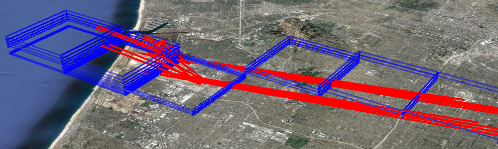
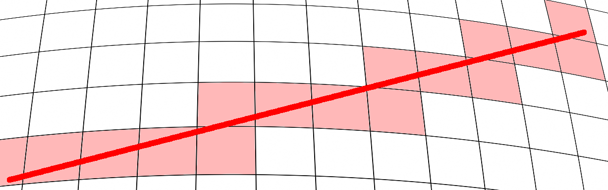
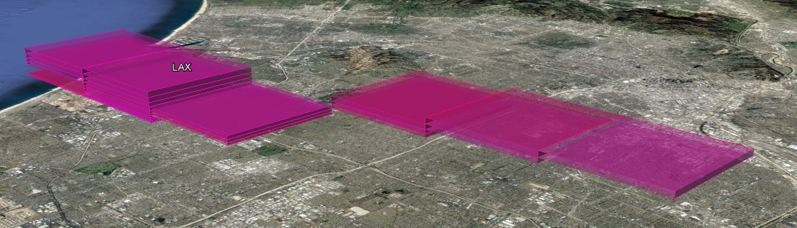

# The Basic Science in GATE - UNDER CONSTRUCTION

## Photochemical Modeling on a 3D Grid

The purpose of the GATE model is to grid aircraft emissions for photochemical modeling.1  Photochemical modeling is the computational process of calculating atmospheric chemistry on a 3D grid given a complete set of air pollutants and meteorology. Typically, the grid is a regular, nearly square grid in the latitude and longitude directions, with grids from 1km to 36km on edge.2 In the vertical direction, the 3D grid tends to be smaller near the ground, where people are most interested in accuracy, and much larger aloft. The aim of the GATE model is to correctly place aircraft emissions in such a 3D grid.

To create gridded, 3D aircraft inventories, the GATE process begins with an emissions inventory.3 Emissions inventories contain ungridded, sometimes annual, emissions from an airport, by vehicle category. In particular, emissions inventories record aircraft emissions up to about 1km in altitude.4 These ungridded emissions need to be divided into hourly pieces and accurately placed into 3D grid cells. Aircraft pose a particular problem for inventory gridding, as their emissions are fundamentally more three dimensional than typical area and point sources. As such, aircraft emissions have usually been given a fairly light treatment.

*Figure 1: 3D allocation of LAX PM Emissions, pre-GATE*

Figure 1 above shows how emissions from Los Angeles International airport (LAX) have typically been distributed in past photochemical models. Emissions are simply placed into a grid cell that covers the geometric centroid of the airport, and possibly one or two grid cells above from that. Without specialized aircraft modeling, the best that was achievable prior to GATE was to model airports as a single point source (that is, with a geometry much like a coal power plant). The goal of the GATE model is to take the next step in improving the realism of how aircraft are portrayed in photochemical modeling.

## 3D Flight Paths

Conceptually, the first step in the GATE model is to calculate the 3D trajectory of planes during their three flight stages: landing, taxiing, and takeoff. The easiest trajectories to calculate are for taxiing, which GATE models as happening on the runways. Luckily, the exact latitude and longitude of every runway at every airport in America is widely known, because pilots need that information. The runway locations were retrieved from the AirportIQ 50105 database, as shown for LAX in Figure 2 below.

*Figure 2: LAX runways*

An example of the runway information, for the state of California, is provided in the GATE repository in a CSV file:

    GATE/input/default/runway_info_cali_***.csv 

GATE uses straight-line representations for the landing and takeoff paths of airplanes towards a runway. Obviously, this is an approximation, as flight paths curve when planes are closer to the ground. However, this approximation is not as bad as it could be since emissions inventories only record airplane emissions up to 1km. At altitudes higher than 1km, airplanes have much more complicated flight paths and trajectories.

In order to simulate these straight, 3D lines for landing and takeoff a few pieces of information are required. First, the location and orientation of the runway, which is described above. And second, the angles at which planes land or takeoff. As it happens, the most common approach angle for an airport is 3 degrees6 7 and the net typical takeoff angle is between 10 and 30 degrees8 9. Since there are a range of possible landing and takeoff angles, GATE models several angles in the accepted range. Figure 3 shows and example of these landing and takeoff paths, for all four runways at the LAX airport.

*Figure 3: LAX flight paths*

## Intersecting Flight Paths with a 3D Grid

The flight paths in Figure 3 have to be intersected with the 3D modeling grid. This is a mathematically hard problem for several reason. First, the grid cells are not truly square, but square along some curved geographic projection. Also, the height of each vertical grid cell is dependent upon the I/J grid location and the meteorology. If the problem were to intersect a line with a regular grid of cubes, or even regular rectangular boxes, it would be much easier. Figure 4 shows how GATE intersects the above LAX flight paths with the 3D modeling grid.

*Figure 4: LAX wire frame*

Finding the grid cells (as show in Figure 4 above) that intersect airplane trajectories is the major technical challenge of the GATE model. Figure 5 shows an exaggerated 2D representation of the problem. The actual modeling grid is based on a curved geographic projection, but the airplane trajectories are straight lines. A precise, general, algebraic solution of the intersection of a straight 3D line with a projected 3D grid is possible. But it is extremely slow, as projection calculations must be continuously done at every stage. Figure 5 is also heavily simplified as it does not show that the height of all vertical layers depends on the I/J grid position.

*Figure 5: 2D curved grid intersection*

Several different solutions were implemented and tested in GATE for the above problem of “intersecting a projected 3D grid with a straight line”. A precise algebraic solution was devised, but it turned out to be prohibitively slow. Bresenham's Line Algorithm10 was much faster, but less accurate, and was hard to adjust for projected and irregular grids. In the end, a more advanced k-d tree11 approach was chosen. The SciPy implementation12 of the k-d tree algorithm was a good balance of performance and accuracy. The k-d tree algorithm can divide any 3D space into a binary search tree, which allows for extremely fast locating of 3d points. Though the algorithm is not exact, it becomes more and more accurate as greater input data is given. In this case, the k-d tree algorithm could be far more accurate if given a 1km grid, rather than a 4km grid.

The end result of all this math is to generate spatial surrogates for each airport. That is, each runway is broken down into three spatial surrogates (landing, taxiing, and takeoff) then all the runway surrogates at a given airport are combined. Then the emissions for each pollutant and aircraft type can be divided into the grid cells defined by the spatial surrogate. Figure 6 shows the end result of the 2012 LAX example that has been built up in this discussion. Shown is the spatial distribution of PM for all airplanes from LAX on the given (arbitrary) day in 2012

*Figure 6: 3D allocation of LAX PM Emissions, with GATE*

## Applying 3D Spatial Surrogates to Inventories

Most aircraft emissions inventories is that they frequently only provide the emissions for a given county. If that is the case, the first thing GATE does is to divide the county-level emissions among the airports in that county using the average number of yearly flights from each airport.

There is one more piece of complexity needed to understand the spatial 3D surrogates described above, and that is how GATE treats flight stages. Using the logic described above spatial surrogates can be constructed for three separate flight stages of airplanes: landing, taxiing, and takeoff. However, most emission inventories do not separate out aircraft emissions in this detail. They simply provide total emissions for these three stages summed together. This is a result of the emission categories typically defined for airplanes (using SIC, SCC, or EIC categories). Interestingly, the calculations that are used to generate aircraft emissions inventories (say using the EDMS model) involve for more detail that is typically lost in an emission inventory.

To improve the accuracy of the GATE model, before spatial surrogates are applied, the aircraft emissions inventory is broken into landing, taxiing, and takeoff components. The flight stage fractions depend on pollutant and vehicle type. And they were calculated based on modeling data taken from an ARB 2012 interstate flight analysis, undertaken by Dr Cody Howard at ARB. An example of such flight fraction data is provided in the GATE repository in a CSV file:

    GATE/input/default/flight_stage_fractions_***.csv

## Temporal Profiles

Most aircraft emissions inventories only report annual emissions. In those cases, GATE is designed to divide the annual totals into hourly pieces to support photochemical modeling. First, monthly temporal profiles divide the annual emissions into 12 pieces. Then, temporal profiles split the emissions again by day-of-week. Finally, two diurnal profiles exist to turn a single day's emissions into 24 hourly components: one for weekdays and one for weekends.

Real flight data was used to generate the above four temporal profiles. The U.S. Bureau of Transportation Statistics13 database was pulled for all commercial flights in California from 2002 to 2015. Flight times were binned to get the above four temporal profiles for all California airports. But also the largest 10 airports in California were analyzed individually using their own flight data to more accurately represent their flight times and temporal profiles. An example of these temporal profiles is provided in the GATE repository in a CSV file at:

    GATE/input/temporal/aircraft_temporal_profiles_***.csv 

## Possible Improvements

> Coming Soon

[Back to Main Readme](../README.md)

## References

1. [US EPA page on Photochemical Modeling](https://www3.epa.gov/scram001/photochemicalindex.htm)
2. [TCEQ 2006 SIP Document - Chapter 2: Photochemical Modeling](http://www.tceq.texas.gov/assets/public/implementation/air/sip/hgb/hgb_sip_2006/06027SIP_proCh2.pdf)
3. [US EPA NEI homepage](https://www.epa.gov/air-emissions-inventories/national-emissions-inventory-nei)
4. [Aircraft Emissions Inventory for Texas Statewide 2014 AERR Inventory and 2008 to 2040 Trend Analysis Years](https://www.tceq.texas.gov/assets/public/implementation/air/am/contracts/reports/ei/582155160603FY1508-20160516-erg-2014_AERR_Inventory_Aircraft_Revised.pdf)
5. [Airport IQ 5010 database](http://www.gcr1.com/5010web/)
6. [Wikipedia – Final Approach (aeronautics)](https://en.wikipedia.org/wiki/Final_approach_%28aeronautics%29)
7. [Pilots, Airplanes, and the Tangent of Three Degrees](https://pumas.nasa.gov/files/10_13_99_1.pdf)
8. [The typical takeoff and climb angles of all Boeing planes](https://www.bangaloreaviation.com/2009/05/typical-takeoff-and-climb-angles-of-all.html)
9. [Boeing: Exceeding Tire Speed Rating During Takeoff](http://www.boeing.com/commercial/aeromagazine/articles/qtr_02_09/pdfs/AERO_Q209_article04.pdf)
10. [Bresenham's Line Algorithm](https://en.wikipedia.org/wiki/Bresenham's_line_algorithm)
11. [k-d tree Algorithm](https://en.wikipedia.org/wiki/K-d_tree)
12. [SciPy implementation of k-d trees](https://docs.scipy.org/doc/scipy/reference/generated/scipy.spatial.cKDTree.query.html#scipy.spatial.cKDTree.query)
13. [Bureau of Transportation Statistics](https://www.transtats.bts.gov/Tables.asp?DB_ID=111&DB_Name=Air%20Carrier%20Statistics%20%28Form%2041%20Traffic%29-%20All%20Carriers&DB_Short_Name=Air%20Carriers)

[Back to Main Readme](../README.md)
