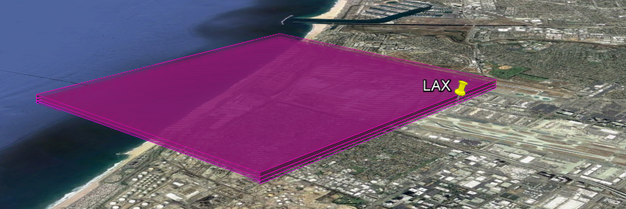
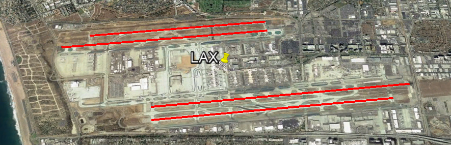
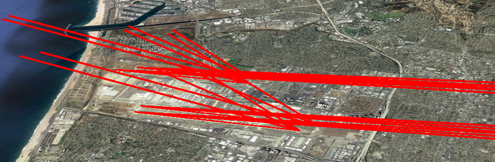

# The Basic Science in GATE - UNDER CONSTRUCTION

## Photochemic Modeling on a 3D Grid

The purpose of the GATE model is to grid aircraft emissions for photochemical modeling.1  Photochemical modeling is the computational process of calculating atmospheric chemistry on a 3D grid given a complete set of air pollutants and meteorology. Typically, the grid is a regular, nearly square grid in the latitude and longitude directions, with grids from 1km to 36km on edge.2 In the vertical direction, the 3D grid tends to be smaller near the ground, where people are most interested in accuracy, and much larger aloft. The aim of the GATE model is to correctly place aircraft emissions in such a 3D grid.

To create gridded, 3D aircraft inventories, the GATE process begins with an emissions inventory.3 Emissions inventories contain ungridded, sometimes annual, emissions from an airport, by vehicle category. In particular, emissions inventories record aircraft emissions up to about 1km in altitude.4 These ungridded emissions need to be divided into hourly pieces and accurately placed into 3D grid cells. Aircraft pose a particular problem for inventory gridding, as their emissions are fundamentally more three dimensional than typical area and point sources. As such, aircraft emissions have usually been given a fairly light treatment.

*Figure 1: 3D allocation of LAX PM Emissions, pre-GATE*

Figure 1 above shows how emissions from Los Angeles International airport (LAX) have typically been distributed in past photochemical models. Emissions are simply placed into a grid cell that covers the geometric centroid of the airport, and possibly one or two grid cells above from that. Without specialized aircraft modeling, the best that was achievable prior to GATE was to model airports as a single point source (that is, with a geometry much like a coal power plant). The goal of the GATE model is to take the next step in improving the realism of how aircraft are portrayed in photochemical modeling.

## 3D Flight Paths

Conceptually, the first step in the GATE model is to calculate the 3D trajectory of planes during their three flight stages: landing, taxiing, and takeoff. The easiest trajectories to calculate are for taxiing, which GATE models as happening on the runways. Luckily, the exact latitude and longitude of every runway at every airport in America is widely known, because pilots need that information. The runway locations were retrieved from the AirportIQ 50105 database, as shown for LAX in Figure 2 below.

*Figure 2: LAX runways*

GATE uses straight-line representations for the landing and takeoff paths of airplanes towards a runway. Obviously, this is an approximation, as flight paths curve when planes are closer to the ground. However, this approximation is not as bad as it could be since emissions inventories only record airplane emissions up to 1km. At altitudes higher than 1km, airplanes have much more complicated flight paths and trajectories.

In order to simulate these straight, 3D lines for landing and takeoff a few pieces of information are required. First, the location and orientation of the runway, which is described above. And second, the angles at which planes land or takeoff. As it happens, the most common approach angle for an airport is 3 degrees6 7 and the net typical takeoff angle is between 10 and 30 degrees8 9. Since there are a range of possible landing and takeoff angles, GATE models several angles in the accepted range. Figure 3 shows and example of these landing and takeoff paths, for all four runways at the LAX airport.

*Figure 3: LAX flight paths*

## Intersecting Flight Paths with a 3D Grid

> Coming Soon

1. Discuss intersecting wireframe with grid. Show wire frame.
2. Discuss problem complexity. Give mathematical approach to solution (ref).
3. Show LAX spatial surrogates (3 x stage), for one runway. Discuss.

## Applying this to Emissions Inventories

> Coming Soon

1. Discuss splitting aircraft emissions by flight stage. (refs)
2. Show final LAX plot (all runways and stages) and discuss.
3. Discuss improvements?  (grid intersect and EDMS for stage)

## Temporal Profiles

> Coming Soon

1. Show temporal analysis from BTS (ref) commercial flight data.
2. Show example temporal profiles

[Back to Main Readme](../README.md)

## References

1. [US EPA page on Photochemical Modeling](https://www3.epa.gov/scram001/photochemicalindex.htm)
2. [TCEQ 2006 SIP Document - Chapter 2: Photochemical Modeling](http://www.tceq.texas.gov/assets/public/implementation/air/sip/hgb/hgb_sip_2006/06027SIP_proCh2.pdf)
3. [US EPA NEI homepage](https://www.epa.gov/air-emissions-inventories/national-emissions-inventory-nei)
4. [Aircraft Emissions Inventory for Texas Statewide 2014 AERR Inventory and 2008 to 2040 Trend Analysis Years](https://www.tceq.texas.gov/assets/public/implementation/air/am/contracts/reports/ei/582155160603FY1508-20160516-erg-2014_AERR_Inventory_Aircraft_Revised.pdf)
5. [Airport IQ 5010 database](http://www.gcr1.com/5010web/)
6. [Wikipedia – Final Approach (aeronautics)](https://en.wikipedia.org/wiki/Final_approach_%28aeronautics%29)
7. [Pilots, Airplanes, and the Tangent of Three Degrees](https://pumas.nasa.gov/files/10_13_99_1.pdf)
8. [The typical takeoff and climb angles of all Boeing planes](https://www.bangaloreaviation.com/2009/05/typical-takeoff-and-climb-angles-of-all.html)
9. [Boeing: Exceeding Tire Speed Rating During Takeoff](http://www.boeing.com/commercial/aeromagazine/articles/qtr_02_09/pdfs/AERO_Q209_article04.pdf)

[Back to Main Readme](../README.md)
